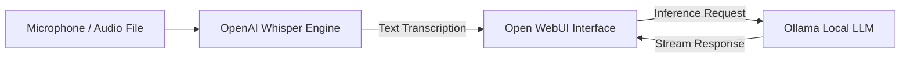

# 🧩 End-to-End Workflow: The 100% Free & Local AI Workstation

This recipe shows how to chain **Ollama** (Local LLM), **Whisper** (Speech-to-Text), and **Open WebUI** (ChatGPT Clone) into a fully offline AI workstation.

---



---

### Step 1: Start Ollama Model Server
```bash
# Pull and start your chosen LLM (e.g. Llama 3.1 8B)
ollama pull llama3.1
ollama run llama3.1
```

### Step 2: Launch Open WebUI with Docker
```bash
docker run -d -p 3000:8080 \
  --add-host=host.docker.internal:host-gateway \
  -v open-webui:/app/backend/data \
  --name open-webui \
  --restart always \
  ghcr.io/open-webui/open-webui:main
```

### Step 3: Transcribe Voice / Meetings Offline with Whisper
```bash
whisper recorded_meeting.mp3 --model medium --output_format txt
```

### Step 4: Drop Transcript into Open WebUI
Paste the generated `.txt` directly into your local Open WebUI at `http://localhost:3000` with the prompt:
```text
Summarize the key decisions, action items, and owners from this meeting transcript into a bulleted Markdown list:
```
