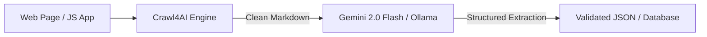

# 🕷️ End-to-End Workflow: AI Web Scraper to Structured JSON

Extract unstructured content from any modern web page and convert it into validated, typed JSON using **Crawl4AI** and **Gemini / Ollama**.

---



---

### Step 1: Install Prerequisites
```bash
pip install crawl4ai pydantic
crawl4ai-setup
```

### Step 2: Complete Extraction Script
```python
import asyncio
from crawl4ai import AsyncWebCrawler
from pydantic import BaseModel
import json

class GitHubRepo(BaseModel):
    name: str
    stars: str
    description: str
    install_command: str

async def extract_page(url: str):
    async with AsyncWebCrawler(verbose=True) as crawler:
        result = await crawler.arun(url=url)
        print("Page crawled successfully! Length:", len(result.markdown))
        # Feed result.markdown into your LLM prompt
        return result.markdown

if __name__ == "__main__":
    asyncio.run(extract_page("https://github.com/trending"))
```
